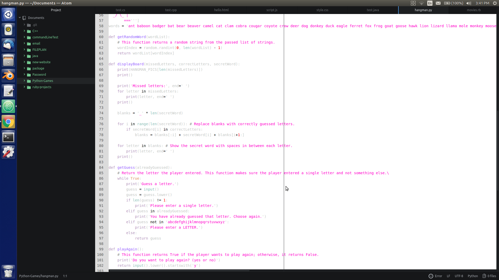
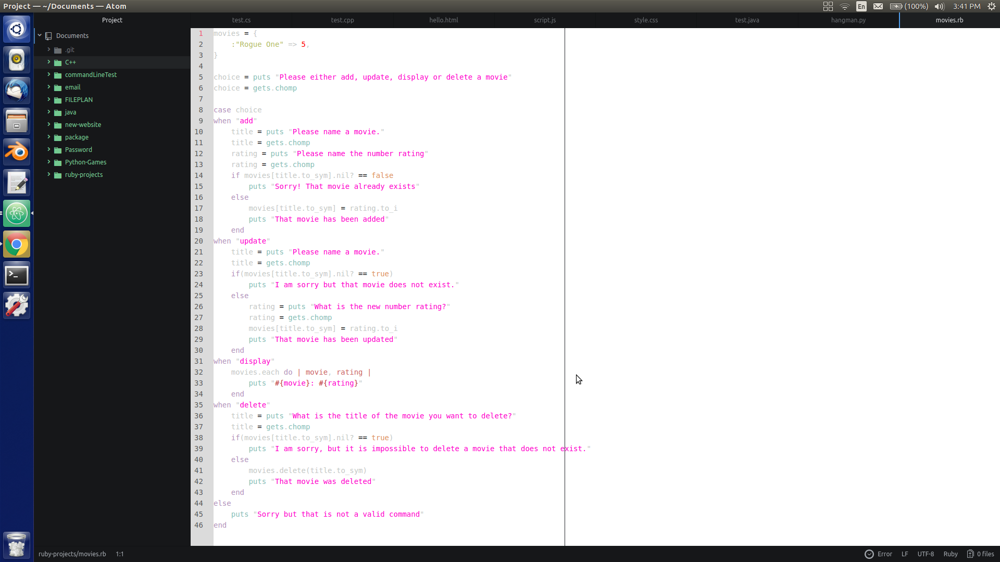
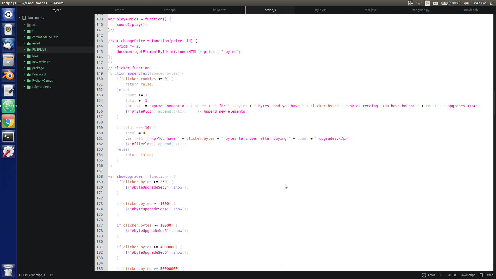
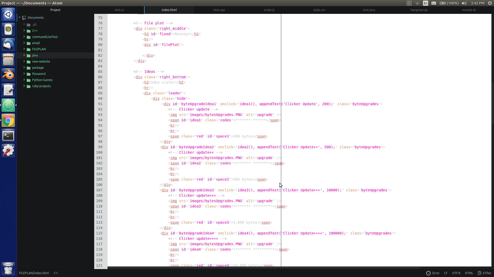
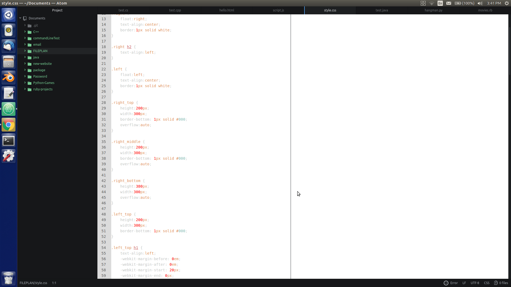
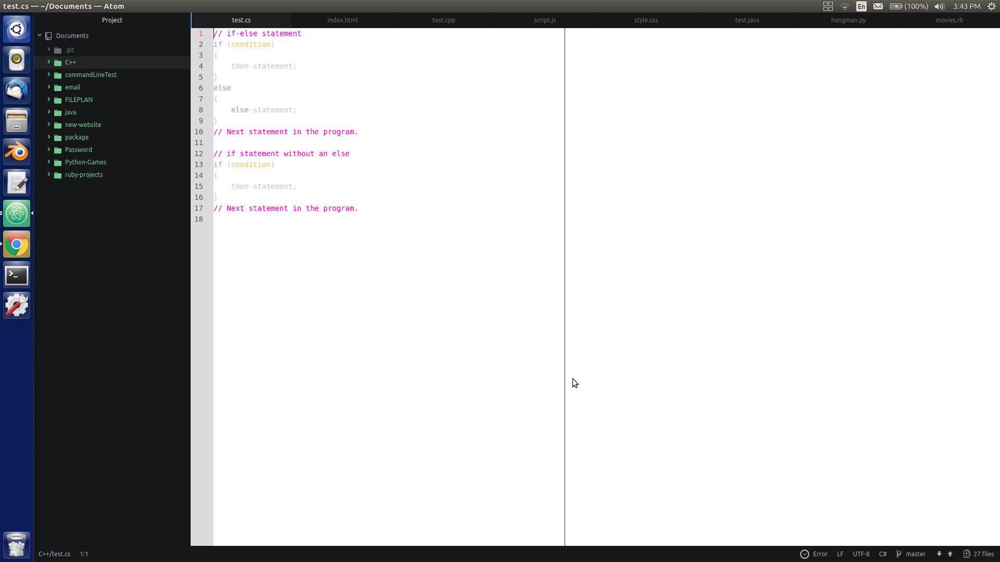
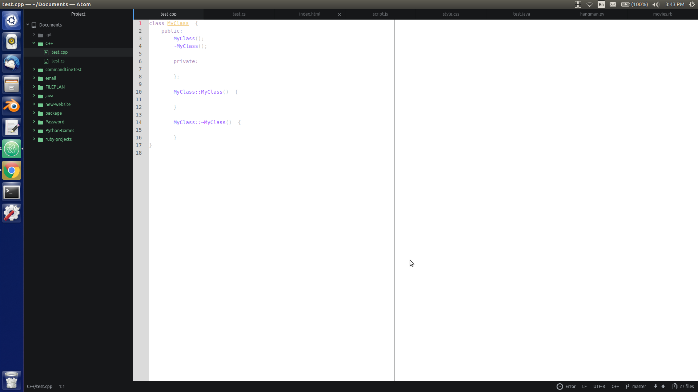

# jedit-white-syntax theme

This is a theme for Jedit. It makes Atom look almost the same a Jedit.

Do you have any ideas for this theme? Please fork this project on Github, and create a pull request.

## TODO:
1. Improve markdown
2. Change selection
3. Change gutter
4. Change screen shots
5. Change some of the syntax highlighting

## CONTRIBUTE(ideas):
- Open an issue
- Fork the repo
- Create pull request
- Email me to contribute*

All Contributions are welcome.

## Badges**

## Screen shots

#### Python

#### Ruby

#### JS

#### Java

#### HTML

#### CSS

#### C Sharp

#### C++

###### * email found on github/StevenCopeland
###### ** Courtesy of the badges package on Atom
